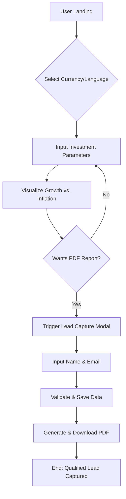

# 🗺️ User Flow Documentation: Financial Tracker

## 1. Flow Overview

The journey is designed as a **Value-First Funnel**. We provide immediate visual gratification (the chart) and then exchange high-value documentation (the PDF) for the user's contact information.

---

## 2. High-Level Logic Path

1. **Entry:** Landing & Context Setting.
2. **Interaction:** Parameter Adjustment (Input).
3. **Visualization:** The "Wealth Gap" Reveal (The Pain Point).
4. **Conversion:** Lead Capture Modal.
5. **Fulfillment:** PDF Download & Email Delivery.

---

## 3. Step-by-Step User Journey

### Phase A: Discovery (The Hook)

- **Step 1: Landing:** User arrives at **Financial Tracker**.
- **Step 2: Localization:** System detects or user selects Language (EN/ES) and Currency (e.g., USD, ARS, MXN).
- **Step 3: Initial Input:** User inputs their current savings and expected monthly contribution.

### Phase B: Realization (The Pain Point)

- **Step 4: Real-time Projection:** As sliders move, the chart updates.
- **Step 5: The Wealth Gap Toggle:** User toggles "Show Inflation Impact."
- **Step 6: visual Shock:** The `Emerald Green` (Nominal) line separates from the `Soft Red` (Real Value) area. The user sees the purchasing power loss.

### Phase C: Conversion (The Exchange)

- **Step 7: CTA Engagement:** User clicks the `CTA Orange` button: **"Download My Full Financial Report."**
- **Step 8: Lead Capture Modal:** \* _BMad Layer: Modals_
- User enters: `First Name`, `Last Name`, and `Email`.
- User accepts Privacy Policy.

- **Step 9: Submission:** System validates data via Angular Signals.

### Phase D: Fulfillment (The Value)

- **Step 10: Success State:** Modal switches to a "Thank You" screen with a progress bar.
- **Step 11: PDF Generation:** **Financial Tracker** generates a personalized PDF client-side.
- **Step 12: Delivery:** \* Automatic browser download of the PDF.
- Background trigger sends the data to the lead repository (LocalStorage/Supabase).

---

## 4. Flowchart Representation (Mermaid Syntax)

---

## 5. Edge Cases & Error Handling

- **Disconnected States:** If market APIs (for inflation rates) fail, use "Last Known Value" or "Standard 4% Default" with a subtle warning.
- **Form Errors:** Real-time validation (e.g., "Invalid Email") using `Soft Red` text without closing the modal.
- **Repetitive Users:** If a lead exists in `LocalStorage`, skip the form and go straight to the download.
