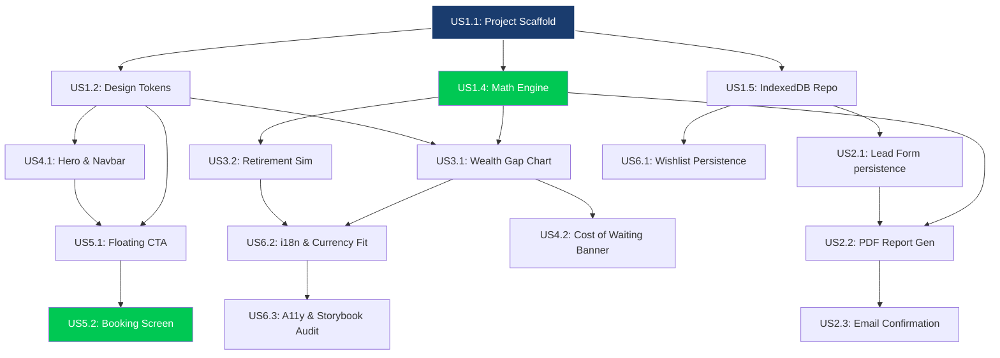

# 🗺️ Project Roadmap: Dependency Analysis & Execution Sequence
> **Financial Tracker** · **Role:** John (PM) · **Framework:** BMAD v4 · **Date:** 2026-02-23
> **Status:** Strategic Alignment Ready · **Source:** Backlog v2.0.0

---

## 🎯 Executive Summary

To ensure a "Clean Build" and minimize technical debt, the implementation of the Financial Tracker must follow a strict logical hierarchy. We cannot build visual charts without the mathematical engine, and we cannot save interaction logs without the infrastructure scaffold.

This document establishes the **Dependency Tree** and the **Sequential Execution Path** (The Golden Path) that the development team must follow.

---

## 🌳 Dependency Map (Mermaid)

---

## 🔢 The "Golden Path" (Execution Sequence)

This is the recommended order of implementation to ensure zero-blockers for developers.

### **Phase 1: The Core (Foundations)**
1.  **US1.1: Project Initialization**: Angular 21, Tailwind v4, Folder setup.
2.  **US1.2: Global Design System**: Tokens and PrimeNG theme.
3.  **US1.4: Math Engine (TDD)**: The pure TypeScript logic (Compounding & Inflation).
4.  **US1.5: IndexedDB Repository**: The persistence layer.

### **Phase 2: The Heart (Visual Models)**
5.  **US3.1: Wealth Gap Chart**: First visual reactive component using the Math Engine (+ US4.3 Market Widgets).
6.  **US3.2: Retirement Simulator**: Secondary model sharing the calculation signals.
7.  **US4.2: Cost of Waiting Banner**: Derived from US3.1/3.2 logic.

### **Phase 3: The Funnel (Conversion)**
8.  **US2.1: Lead Capture Form**: Using persistence from Phase 1.
9.  **US2.2: PDF Report Generation**: Using Math Engine + Charts.
10. **US2.3/5.3: Email Delivery**: Post-lead automation.
11. **US5.1/5.2: Booking Flow**: The final conversion step.

### **Phase 4: Optimization (Retention & Polish)**
12. **US6.1: Wishlist Board**: Emotional gamification.
13. **US6.2: i18n & Currency Fit**: Localization logic.
14. **US6.3/6.4: Audit & Performance**: Final production polishing.

---

## 🛑 Constraint Rules (Hard dependencies)

To maintain architectural integrity, the following rules apply:

1.  **Core-First Rule**: No UI component (Epic 3/4) can be started if its corresponding Math Logic (US1.4) or Design System (US1.2) is not in `PASS` state.
2.  **Persistence-First Rule**: The Lead Form (US2.1) cannot be implemented before the IndexedDB Repository (US1.5).
3.  **TDD Protocol**: US1.4 (Math Engine) MUST reach 100% coverage before US2.2 (PDF) or US3.1 (Charts) attempt to consume its exports.
4.  **No-Orphan Stories**: A story cannot be moved to "In Progress" if any of its parent dependencies in the Mermaid diagram are not at least "In Review".

---

## 📌 Compliance Checks (PM Gate)

Before a story is considered ready for construction by Angi (Frontend), the following must be verified:
- [ ] Requirements are enriched via `/enrich-user-story`.
- [ ] Dependency parent stories are marked as `DONE` or `REVIEW`.
- [ ] Technical Spec (Organism/Architecture) is indexed in `PROJECT_INDEX.md`.

---

*— John, PM · Financial Tracker · BMAD v4 · 2026-02-23*
