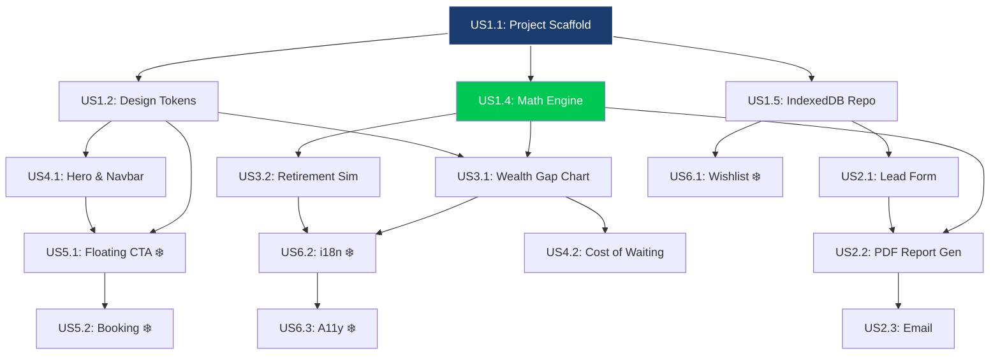
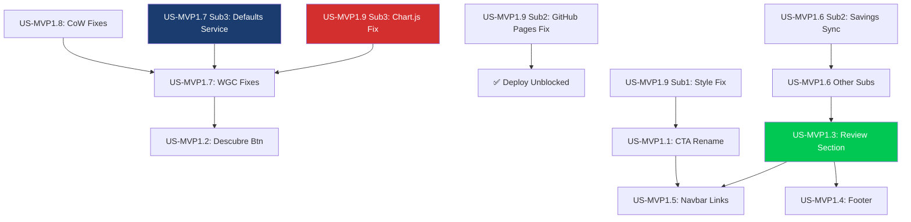

# 🗺️ Project Roadmap: Dependency Analysis & Execution Sequence
> **Financial Tracker** · **Role:** John (PM) · **Framework:** BMAD v4 · **Date:** 2026-03-06
> **Status:** UPDATED FOR MVP#1 · **Source:** Backlog v3.0.0

---

## 🎯 Executive Summary

Updated dependency tree to include the new MVP#1 requirements (Episode 7). The original dependency rules remain in force. New MVP#1 stories are mapped on sub-dependencies from the existing implemented features.

---

## 🌳 Original Dependency Map (Epics 1–6)

---

## 🚀 MVP#1 Dependency Map (Epic 7 — New)

---

## 🔢 MVP#1 "Golden Path" (Sprint 4 Execution Sequence)

> Zero-blocker order for developer implementation.

### **Phase A: Infrastructure & Critical Fixes (Unblock Everything)**

1. **US-MVP1.9 Sub3** — Chart.js registration fix
2. **US-MVP1.9 Sub2** — GitHub Pages 404 fix
3. **US-MVP1.7 Sub3** — Simulator Defaults Service + JSON config
4. **US-MVP1.6 Sub2** — Savings sync bug (shared state)
5. **US-MVP1.8** — Cost of Waiting input fixes + layout fix

### **Phase B: Charts & Sliders**

6. **US-MVP1.7 Sub1** — WGC compact layout
7. **US-MVP1.7 Sub2** — Slider graduation
8. **US-MVP1.7 Sub4** — Slider track fill

### **Phase C: Simulator UX**

9. **US-MVP1.6 Sub1** — Age validation modal
10. **US-MVP1.6 Sub3** — Scroll to "Obtener Plan" (Step 3)
11. **US-MVP1.6 Sub4** — Scroll to "Agenda" after download+email

### **Phase D: Visual & CTA**

12. **US-MVP1.9 Sub1** — "Comenzar" button style fix
13. **US-MVP1.1** — "Asesoría Gratuita" CTA rename + Calendly
14. **US-MVP1.2** — "Descubre como Evitarlo" button on WGC

### **Phase E: New Sections**

15. **US-MVP1.4** — Footer component
16. **US-MVP1.3** — Review Call section
17. **US-MVP1.5** — Navbar section navigation

---

## 🛑 Constraint Rules (Hard Dependencies)

1. **Core-First Rule (Original):** No UI component can be started if its Math Logic (US1.4) or Design System (US1.2) are not `PASS`.
2. **Charts-First Rule (NEW):** Chart.js registration fix (US-MVP1.9 Sub3) must be applied before any chart-related work.
3. **State-First Rule (NEW):** Savings sync fix (US-MVP1.6 Sub2) must be verified with unit tests before implementing US-MVP1.6 Sub3/4.
4. **Anchor-First Rule (NEW):** Section IDs must be added to target sections before implementing Navbar navigation (US-MVP1.5).
5. **Review Section First:** US-MVP1.3 must be implemented before US-MVP1.5 so the `#agenda-llamada` anchor exists.

---

## 📌 Compliance Checks (PM Gate — Extended for MVP#1)

Before a story is considered ready for construction:
- [ ] Requirements enriched in the US file.
- [ ] Dependency parent stories marked `DONE` or `REVIEW`.
- [ ] Story references section anchor IDs (for navigation stories).
- [ ] Unit test defined for state-sync issues.
- [ ] Responsive breakpoints defined.

---

*— John, PM · Financial Tracker · BMAD v4 · 2026-03-06*
