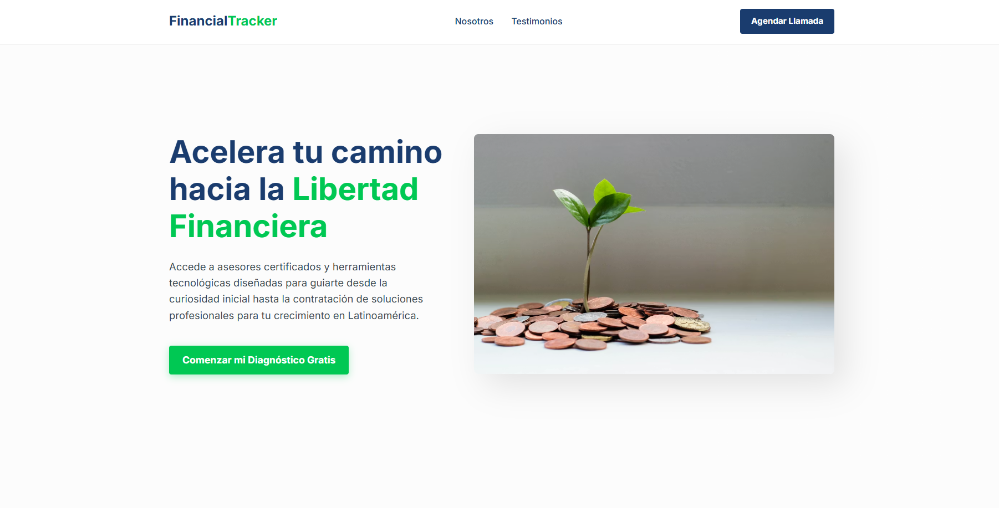

# Color Palette by Elements

Para mantener la elegancia en una plataforma financiera con una paleta tan vibrante, la clave es la **moderación**. El error común es usar todos los colores con la misma intensidad. Para que se vea profesional y de "alta gama", debemos aplicar una jerarquía donde el **Azul** y el **Gris Nube** dominen el espacio, dejando los colores brillantes para "pinceladas" de interacción.

Aquí tienes la asignación estratégica de colores para tu Landing Page:

---

## 1. Estructura y Fondos (El Lienzo)

- **Fondo Principal de la Web:** **#ECEFF1** (Gris Nube).

  > _Por qué:_ El blanco puro puede ser muy agresivo; este gris sutil da una sensación de software financiero robusto y profesional.

- **Fondo del Hero Section (Cabecera):** **#1A3C6E** (Azul Marino).

  > _Por qué:_ Es el primer impacto. Un fondo oscuro con texto claro transmite autoridad y seguridad inmediata.

- **Menú Horizontal Superior:** **#1A3C6E** (Fondo) o **#37474F** (Texto sobre fondo claro).

---

## 2. Tipografía (La Lectura)

- **Títulos Principales (H1, H2):** **#1A3C6E** (Azul Marino).

  > _Por qué:_ El azul oscuro es más elegante que el negro puro y mantiene la identidad de marca en cada frase.

- **Cuerpo de Texto y Párrafos:** **#37474F** (Gris Carbón).

  > _Por qué:_ Es más suave para la vista que el negro, facilitando la lectura de explicaciones sobre salud financiera.

- **Texto sobre fondos oscuros (Hero):** **#ECEFF1** (Gris Nube) o Blanco.

---

## 3. Botones y Llamados a la Acción (CTA)

- **Botón Principal (El más importante):** **#00C853** (Verde Esmeralda).

  > _Uso:_ "Contratar Asesoría" o "Empezar Diagnóstico". Este verde sobre el fondo azul del Hero o el gris del cuerpo resaltará con elegancia y positivismo.

- **Botón Secundario o de Registro:** **#F57C00** (Naranja).

  > _Uso:_ "Iniciar Sesión" o "Saber más". Debe ser visible pero no competir con el verde del éxito financiero.

- **Botones de "Ghost" (Delineados):** Usa el borde en **#1A3C6E** para acciones de navegación menores.

---

## 4. Iconografía y Elementos Visuales

- **Iconos de Beneficios:** **#009688** (Teal).

  > _Por qué:_ El Teal es el color de la tecnología financiera. Úsalo en iconos lineales (no rellenos) para que se vean refinados.

- **Indicadores de Salud Financiera (Semáforo):**
- **#D32F2F (Rojo):** Solo para deudas, gastos excesivos o alertas críticas.
- **#FFC107 (Ámbar):** Para consejos, "atención en este ahorro" o tips preventivos.
- **#00C853 (Verde):** Para metas cumplidas e ingresos.

---

## 💡 Regla de Oro para la Elegancia

Para que no parezca una aplicación de juegos, aplica la proporción **80/15/5**:

- **80%** de la página debe ser **Gris Nube (#ECEFF1)** y **Azul (#1A3C6E)**.
- **15%** deben ser los textos en **Gris Carbón (#37474F)** e iconos en **Teal (#009688)**.
- **Solo el 5%** de la pantalla debe tener los colores **Verde, Naranja o Rojo** (solo en botones y alertas específicas).

---

# Using Proven Structure

Esta es una excelente propuesta. Usar una estructura probada (que es limpia y corporativa) pero inyectando tu nueva paleta de colores es la forma perfecta de equilibrar la **elegancia institucional** con la **modernidad fintech**.

## Proven Design Image for Reference

A continuación, presento el diseño aplicado. He traducido los elementos de la imagen de referencia a tu contexto financiero, utilizando la jerarquía de colores que definimos para mantener la elegancia.

### El Concepto de Diseño Aplicado

1. **Fondo General (#ECEFF1):** Mantenemos el "Gris Nube" para que todo se sienta limpio y luminoso, imitando el fondo blanco de la referencia pero con menos dureza.
2. **Menú Superior:**

- Fondo limpio. Enlaces en **Azul Marino (#1A3C6E)** para seriedad.
- Botón Superior ("Agendar Llamada"): Lo haremos en **Azul Marino (#1A3C6E)** sólido. Esto lo ancla como una función corporativa "seria", diferenciándolo del botón principal de venta.

3. **Hero Section (Texto):**

- Título Principal (H1): En **Azul Marino (#1A3C6E)**.
- El "Highlight" (que en la imagen es naranja): Usaremos tu **Verde Neón (#00C853)**. Esto es crucial. Cambia el mensaje de "urgencia" (naranja) a **"crecimiento y dinero" (verde)**.
- Subtexto: En **Gris Carbón (#37474F)** para una lectura fácil.

4. **Botón Principal (CTA):**

- El protagonista absoluto. Usaremos el **Verde Neón (#00C853)**. Será el elemento más vibrante de la pantalla, atrayendo el clic hacia la "salud financiera".

### Draft Design Image

---
